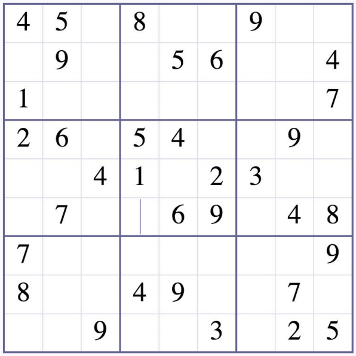
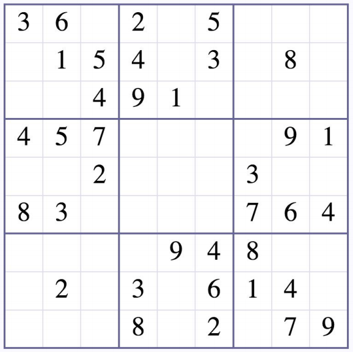

# Interview Question:
Write a simple Sudoku solver for the following 2 sudoku puzzles. 
The interviewer explained the rules of sudoku and how to solve a Sudoku (Personally I think that he didn't do a great job 
Time Limit: 90 minutes, I managed to get it done just under that.
All I got was an image with these 2 pictures:

Puzzle 1:

Puzzle 2:

There were no requirements regarding puzzle input format as a flat file, reading from console or even any on screen output. 
The test was to look at how the main solving logic is structured, So I took
the approach to just put the puzzle as hard coded test cases and 
wrote unit tests to solve the board

## Solution Outline:
There probably could've been a way to do this with recurrsion, 
but I usually avoid recurrsion if possible as it's easy to get it wrong and use up a ton of resources, 
hence the choice of a while loop with the condition check for a count of unsolved cells and also a counter
to avoid unending loop.

Algorithm works by elimintion of invalid values
e.g. "if there's a 5 somewhere on the row then this cell can't be a 5":
1. Start with 1~9 
2. Find all the numbers in that column that this cell that is **Invalid** 
3. Find all the numbers in that row that this cell that is **Invalid**
4. Find all the numbers in that sector that this cell that is **Invalid**
5. If after eliminating the invalid values, you are left with 1 value, then that must be the correct answer.
6. From the way interviewer explained Sudoku, I think this was all that he wanted, but I added an additional check for
  being the only cell that a value has a spot to go in:
    - Logic: If we find all of the values that can't go into the rest of this sector out of this list, then this is the only cell in this sector that can hold that value.
      
      e.g. If we have 2 and 4 remaining in this list, but every other cell in the sector cannot have 2 as a value (based on logic 2~4 for all cells in rest of sector), then 2 must go into this cell

This solution works for easy puzzles but doesn't solve for more difficult puzzles.
It's probably not the fastest / best solution to this interview question, 
but considering I was caught a little off guard that this was the type of question and 
that I had to work under time pressure, I'm pretty happy I got something working, with unit tests within the time limit. 

